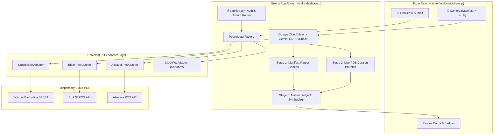

# 🌿 Dankley Universal Inventory Intaker — Developer Handoff Manual

> **Welcome to the Dankley Universal Intake Architecture.**
> This repository is a decoupled, POS-agnostic cannabis inventory intake system designed to take physical shipping manifests and SKU packaging from delivery truck to point-of-sale in **under 5 minutes** ("Photograph -> AI Synthesis -> One-Hit Submit Boom").

---

## 1. Executive Overview & Architectural Philosophy

### The Problem in Cannabis Retail
Every cannabis dispensary faces the same bottleneck: **paper manifests and slow manual inventory data entry**.
- State-mandated Metrc transport manifests list dozens of 24-character RFID tags (`1A4120300...`), batch numbers, and wholesale costs.
- Product packages carry critical physical ground-truth data: certified lab test decimals (e.g. `40.36% THC`), batch lot numbers, hand-written expiration dates, and complex multi-chamber strain badges (e.g. `Apples & Bananas (Sativa Hybrid) x Huckleberry Gelato (Indica Hybrid)`).
- Traditional budtenders spend 45–90 minutes manually typing each line item into the POS, leading to human error, typos, and inventory sync discrepancies.

### The Dankley Solution: The "App-As-A-Vessel" Standard
In this architecture:
1. **AI Deals with Decisions**: Visual perception, manifest-to-photo correlations, strain lineage deductions, and compliance lab test priority (e.g., prioritizing certified compliance sticker decimals over rounded marketing integers) are decided natively by **Google Gemini Vision & Master Judge AI**.
2. **The App Acts as a Vessel**: The application structures context (live POS categories, live brand catalogs, clean OCR transcripts) and molds the AI's synthesized outputs to the POS system:
   - Derives 13% pre-tax to out-the-door math (`price_otd = retail * 1.13`).
   - Strict regulatory usable weight invariants (e.g. NYS 100mg THC edible usable weight: `parsed_weight_useable: 100`, `uom: "Milligrams"`).
   - Enforces the **Zero Auto-Doubling Pricing Rule**: New product shells default to `"0.00"` retail price for manual operator pricing; existing items inherit established retail prices directly from the POS catalog.

---

## 2. Multi-Store POS Agnostic Architecture

Dankley operates across multiple store locations with different POS systems:
- **Dankley Queens (Flagship)**: Current baseline on **Alleaves POS**.
- **Dankley Manhattan / North Location**: Powered by **Dutchie POS**.
- **Dankley Next-Gen Migration Target**: Shifting Queens baseline to **BLAZE POS**.
- **Local Developer Environment**: Zero-dependency **Mock Sandbox POS**.



---

## 3. The Playwright Network Sniffer Engine

### Why Sniffing is Required
Most cannabis POS platforms (Dutchie, Alleaves, BLAZE) do **not** provide public self-serve OAuth tools or complete REST API documentation.
To solve this without waiting for third-party vendor approvals, Dankley pioneered the **Playwright Headless Session Sniffer**:
1. When you need to connect to a POS, run our automated sniffer script:
   ```bash
   # Sniff Dutchie backoffice tokens and GraphQL endpoints
   npm run sniff:dutchie

   # Sniff BLAZE POS admin session and inventory routes
   npm run sniff:blaze
   ```
2. A browser window opens. Log into your dispensary backoffice.
3. The sniffer hooks into `page.on('response')`, intercepts the Bearer JWT / API session token and shop headers, and automatically saves them to:
   - `.dutchie_token.json`
   - `.blaze_token.json`
   - `.alleaves_token.json`
4. The backend adapters (`DutchiePosAdapter`, `BlazePosAdapter`, `AlleavesPosAdapter`) automatically read these cached session files. When a token expires, the adapter's `PlaywrightSessionSniffer` can silently re-authenticate in the background!

See [`PLAYWRIGHT_SNIFFER_PLAYBOOK.md`](./PLAYWRIGHT_SNIFFER_PLAYBOOK.md) for full details.

---

## 4. Multi-Tenant Auth for `@dankley.com` & Model Pooling

### Authentication Rule
Access is strictly gated to verified `@dankley.com` email addresses (`src/lib/auth.js`):
- Any non-dankley email is immediately rejected with HTTP 403.
- When an operator logs in, the system checks `src/config/dankleyLocations.json`:
  - `queens@dankley.com` -> Allocated to **Queens (Alleaves / Blaze)**.
  - `dutchie@dankley.com` -> Allocated to **Manhattan (Dutchie POS)**.
  - `blaze.dev@dankley.com` -> Allocated to **Queens Blaze Migration**.
  - Any new team member (`name@dankley.com`) -> Automatically onboarded to the **Sandbox**.

### Shared Model Billing & API Pooling
The AI provider layer (`src/lib/ai/geminiProvider.js`) meters prompt and candidate tokens for every intake run:
- In `geminiProvider.js`, token counts are tracked per request.
- If stores want to **pool API costs**, use a single `GEMINI_API_KEY` in `.env.local`.
- If stores want **separate billing**, define location keys:
  - `GEMINI_API_KEY_QUEENS=...`
  - `GEMINI_API_KEY_DUTCHIE=...`

---

## 5. Quickstart: Running Locally in 5 Minutes

### Step 1: Install Dependencies
```bash
# Dashboard / Backend
cd intake-dashboard
npm install

# Mobile App
cd ../intake-mobile-app
npm install
```

### Step 2: Configure Environment
Copy `.env.example` to `intake-dashboard/.env.local`:
```bash
cp .env.example intake-dashboard/.env.local
```
Add your `GEMINI_API_KEY` from [Google AI Studio](https://aistudio.google.com/).

### Step 3: Run the Test Suite
Verify that all POS adapters, hardware conflict gates, and lineage parsers pass:
```bash
cd intake-dashboard
npm test
```
All test suites run in ~1.5s with 100% green passing results.

### Step 4: Start the Servers
```bash
# Terminal 1: Backend Orchestrator (Port 3000)
npm run dashboard:dev

# Terminal 2: Expo Mobile App (Port 8081)
npm run mobile:start
```

---

## 6. How to Implement Your Location's Dutchie POS Adapter

Open `intake-dashboard/src/lib/posAdapters/DutchiePosAdapter.js`:
1. **Sniff your Dutchie Endpoints**:
   Run `npm run sniff:dutchie` and perform one manual inventory intake in Dutchie. Look at `network_logs_dutchie_[timestamp].json`.
2. **Review Dutchie Endpoints**:
   - Product Catalog: `GET /api/v1/products`
   - Inventory Intake: `POST /api/v1/inventory/intake`
3. **Set your Credentials in `.env.local`**:
   ```env
   DUTCHIE_API_KEY=your_key_or_token
   DUTCHIE_LOCATION_ID=your_dutchie_store_id
   ```
4. Run the adapter test:
   ```bash
   npx jest tests/dutchie-adapter.test.js
   ```

For detailed guidance, see [`DUTCHIE_INTEGRATION_GUIDE.md`](./DUTCHIE_INTEGRATION_GUIDE.md).

---

*Authored by Dankley AI Engineering — October 2026*
