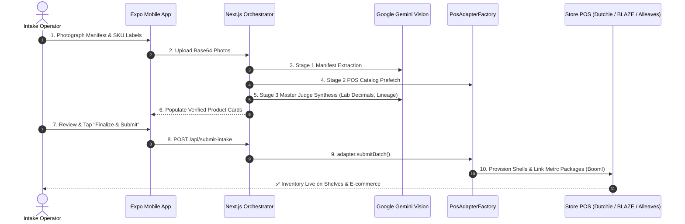

# 🌿 Inventory Intaker Dankley Universal App

> **POS-Agnostic Cannabis Inventory Intake & Automation Architecture**
> Built for **Dankley Dispensaries** (Queens, Manhattan & Next-Gen Stores).
> Powered by **Google Gemini Vision & Master Judge AI**, **Expo React Native**, and **Next.js 14 App Router**.

[]()
[]()
[]()

---

## ⚡ The 5-Minute Intake Experience

Our goal is simple: **deliver truck to point-of-sale in under 5 minutes** ("Photograph -> AI Synthesis -> One-Hit Submit Boom").



---

## 🏗️ System Architecture & Multi-Store Routing

Dankley operates across multiple stores with distinct POS systems. The Universal App decouples business logic from POS specifics using the **Universal POS Adapter Pattern**:

| Location | POS Engine | Status | Adapter |
|---|---|---|---|
| **Dankley Queens (Flagship)** | Alleaves POS | Active Baseline | `AlleavesPosAdapter.js` |
| **Dankley Queens (Next-Gen)** | BLAZE POS | Migration Target | `BlazePosAdapter.js` |
| **Dankley Manhattan** | Dutchie POS | Location 2 Target | `DutchiePosAdapter.js` |
| **Universal Developer Sandbox** | Mock POS | Zero-Dependency Dev | `MockPosAdapter.js` |

### 🔐 Multi-Tenant Authentication (`@dankley.com`)
- System access is strictly gated to verified `@dankley.com` accounts (`src/lib/auth.js`).
- Logging in automatically allocates the operator's store location, assigned POS system, and AI model tier.
- Zero committed secrets: all credentials managed via `.env.local`.

---

## 🚀 Quick Start Guide

### 1. Clone & Setup Environment
```bash
# Copy environment template
cp .env.example intake-dashboard/.env.local
```
Add your `GEMINI_API_KEY` from [Google AI Studio](https://aistudio.google.com/).

### 2. Run Test Suite
```bash
cd intake-dashboard
npm test
```
All integration suites pass 100% green:
- `@dankley.com` Domain & Location Routing Suite
- Dutchie POS Adapter Suite
- BLAZE POS Adapter Suite
- Hardware Conflict Isolation & Dual-Chamber Lineage Suite

### 3. Launch Development Servers
```bash
# Terminal 1: Backend Orchestrator (Port 3000)
cd intake-dashboard
npm run dev

# Terminal 2: Expo Mobile Client (Port 8081)
cd ../intake-mobile-app
npx expo start
```

---

## 📚 Developer Guides & Documentation

- 📖 **[Developer Handoff Manual](./DEVELOPER_HANDOFF.md)**: Deep dive into the AI synthesis pipeline, ground-truth lab decimals, dual-chamber lineage, and shared model cost pooling.
- 🛒 **[Dutchie POS Integration Guide](./DUTCHIE_INTEGRATION_GUIDE.md)**: Tutorial on Dutchie backoffice structure, catalog mapping, and Metrc inventory package intake.
- 🔥 **[BLAZE POS Migration Guide](./BLAZE_MIGRATION_GUIDE.md)**: Roadmap and adapter guide for migrating from Alleaves to BLAZE POS.
- 🕵️‍♂️ **[Playwright Sniffer Playbook](./PLAYWRIGHT_SNIFFER_PLAYBOOK.md)**: How to reverse engineer and sniff Bearer tokens from ANY cannabis POS in under 15 minutes.

---

## 📁 Repository Structure

```
Inventory_Intaker_Dankley_Universal_App/
├── .env.example                  # Environment configuration template (zero committed keys)
├── .gitignore                    # Excludes node_modules, temp_sessions, and caches
├── README.md                     # You are here
├── DEVELOPER_HANDOFF.md          # Comprehensive developer handoff manual
├── DUTCHIE_INTEGRATION_GUIDE.md  # Dutchie POS integration tutorial
├── BLAZE_MIGRATION_GUIDE.md      # BLAZE POS migration guide
├── PLAYWRIGHT_SNIFFER_PLAYBOOK.md# Reverse engineering and sniffing playbook
├── package.json                  # Root workspace script runner
├── scripts/
│   └── sniff_pos_network.js      # Interactive Playwright token sniffer CLI
├── intake-dashboard/             # Next.js 14 App Router API & Orchestrator
│   ├── package.json
│   ├── next.config.mjs
│   ├── src/
│   │   ├── app/api/
│   │   │   ├── auth/             # Login, Me, and Logout routes for @dankley.com
│   │   │   ├── pos/              # Dynamic POS categories, config, and package costs
│   │   │   ├── process-image-async/ # Multi-tier OCR & Vision routing
│   │   │   ├── process-intake/   # 3-Stage Manifest & Judge AI synthesis
│   │   │   ├── preview-intake/   # Preflight review validation
│   │   │   └── submit-intake/    # POS batch finalization
│   │   ├── config/
│   │   │   └── dankleyLocations.json # Multi-store location & POS config
│   │   └── lib/
│   │       ├── auth.js           # Multi-tenant auth & JWT utility
│   │       ├── ai/geminiProvider.js # Centralized Gemini models & cost tracking
│   │       ├── posAdapters/      # Universal POS Adapter layer (Dutchie, Blaze, Alleaves, Mock)
│   │       └── brandTaxonomy/    # Cannabis brand intelligence (Eureka, Camino, Cookies, etc.)
│   └── tests/                    # Jest automated integration test suite
└── intake-mobile-app/            # Expo React Native Mobile Client
    ├── package.json
    ├── app/                      # Expo Router screens (Main Intake, Camera, Settings)
    ├── components/
    │   ├── auth/LocationBadge.tsx# Store location & POS indicator
    │   └── intake/               # Item cards, modals, dropdowns
    ├── services/                 # Mobile API & Auth services
    └── utils/                    # POS taxonomy helpers
```

---

*© 2026 Dankley Cannabis Dispensaries. Public Read-Only Distribution.*
